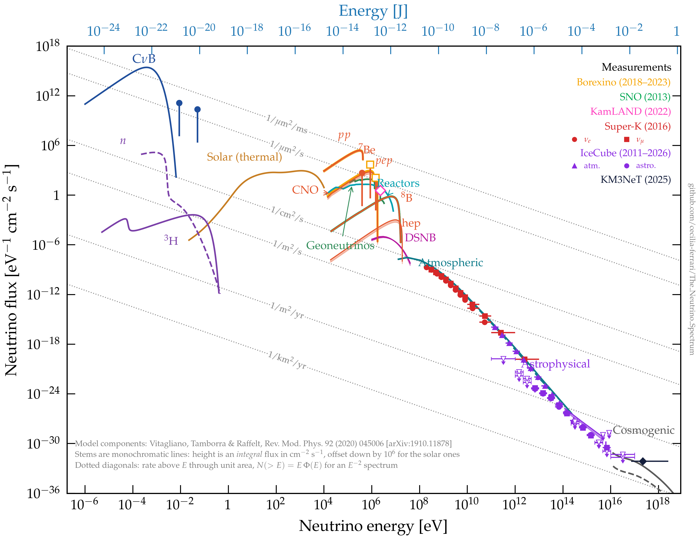
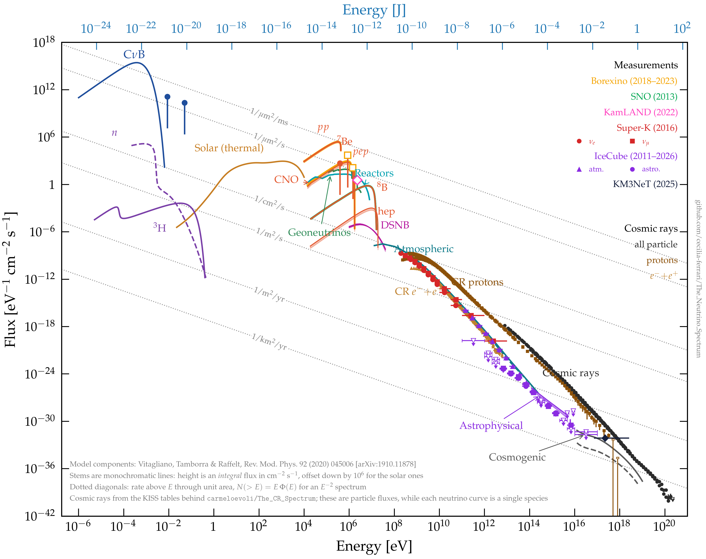
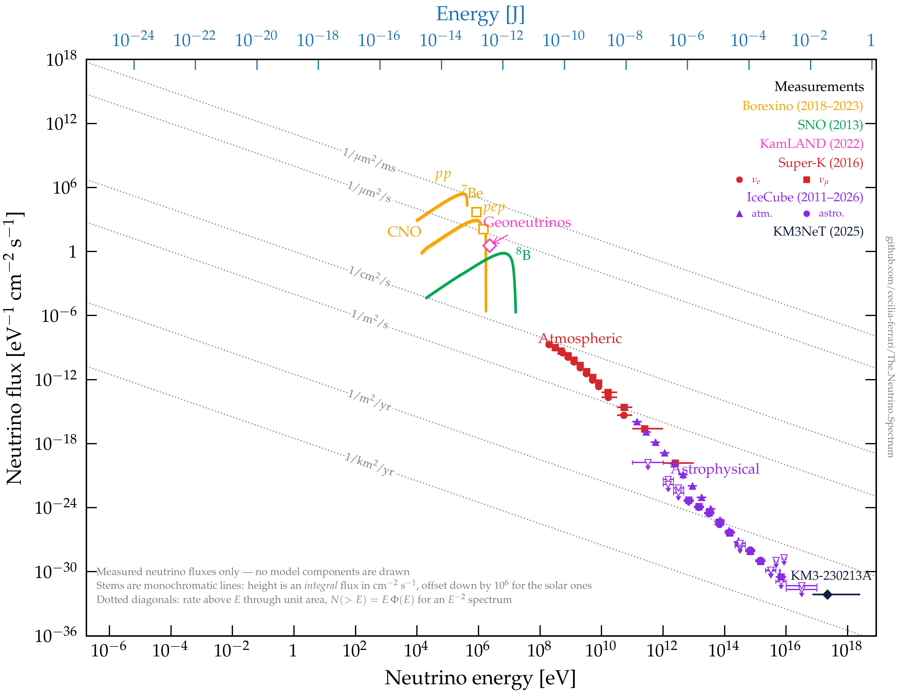

[](https://opensource.org/licenses/mit-license.php)

## The Neutrino Spectrum — GUNS at Earth

The neutrino counterpart of [`The_CR_Spectrum`](https://github.com/carmeloevoli/The_CR_Spectrum):
one plot collecting every known neutrino flux arriving at Earth, from the meV
relic neutrinos to the EeV cosmogenic ones — the *Grand Unified Neutrino
Spectrum* (GUNS) of

> E. Vitagliano, I. Tamborra, G. Raffelt,
> *Grand Unified Neutrino Spectrum at Earth: Sources and spectral components*,
> Rev. Mod. Phys. **92** (2020) 045006 — [arXiv:1910.11878](https://arxiv.org/abs/1910.11878)

with measurements from the experiments discussed in that review overlaid on top.

### <a name="nuspectrum"></a>
### The three plots

**1. The neutrino spectrum** — GUNS model components with the measurements overlaid.



[png](figures/The_Neutrino_Spectrum.png) · [pdf](figures/The_Neutrino_Spectrum.pdf) · `python3 The_Neutrino_Spectrum.py`

**2. The multimessenger spectrum** — the same, plus the charged cosmic rays of
[`The_CR_Spectrum`](https://github.com/carmeloevoli/The_CR_Spectrum). The axes are
widened to 10²¹ eV and down to 10⁻⁴² eV⁻¹ cm⁻² s⁻¹ so that the ultra-high-energy
end of the cosmic-ray spectrum fits.



[png](figures/The_Multimessenger_Spectrum.png) · [pdf](figures/The_Multimessenger_Spectrum.pdf) · `python3 The_Multimessenger_Spectrum.py`

**3. The measured neutrino spectrum** — measurements only, no model curves, on
exactly the same axes, limits and aspect ratio as plot 1, so the two can be laid
side by side and what is measured read straight off against what is predicted.



[png](figures/The_Measured_Neutrino_Spectrum.png) · [pdf](figures/The_Measured_Neutrino_Spectrum.pdf) · `python3 The_Measured_Neutrino_Spectrum.py`

### What is in the plot

**Model components** (solid/dashed curves and shaded bands) are the GUNS
components, taken from the ancillary tables of arXiv:1910.11878:

| Component | Source table | Notes |
|---|---|---|
| Cosmic neutrino background | `CNB.dat`, `CNB-lines.dat` | continuum + the ν₂, ν₃ mass-eigenstate lines |
| BBN relics | `BBN-tritium.dat`, `BBN-neutron.dat` | ³H (solid) and neutron decay (dashed) |
| Solar, thermal | `Sun-thermal.dat` | plasmon, photo-, bremsstrahlung neutrinos |
| Solar, nuclear | `Sun-nuclear-*.dat`, `Sun-lines.dat` | pp, ⁸B, hep, ¹³N, ¹⁵O continua + ⁷Be, pep lines |
| Geoneutrinos | `Geoneutrinos.dat` | ²³⁸U, ²³²Th and ⁴⁰K |
| Reactors | `Reactor.dat` | |
| DSNB | `DSNB.dat` | ν and ν̄ bands |
| Atmospheric | `Atmospheric.dat` | ν (solid) and ν̄ (dashed) |
| Astrophysical | `IceCube.dat` | IceCube 2017 diffuse band |
| Cosmogenic | `Cosmogenic.dat` | He (solid) and Fe (dashed) primaries |

**Measurements** (markers and filled bands, colour-coded per experiment; the
legend carries the year of each result):

| Experiment | Quantity | Reference |
|---|---|---|
| Borexino | pp, ⁷Be, pep, CNO fluxes | Nature **562** (2018) 505; Phys. Rev. D **108** (2023) 102005 |
| SNO | ⁸B total (NC) flux | Phys. Rev. C **88** (2013) 025501 |
| KamLAND | U+Th geoneutrino flux | Geophys. Res. Lett. **49** (2022) e2022GL099566 |
| Super-Kamiokande | atmospheric ν_e (circles) and ν_μ (squares) spectra, 0.16–10⁴ GeV | Phys. Rev. D **94** (2016) 052001 |
| IceCube | atmospheric ν_μ spectrum (triangles), 100 GeV–400 TeV | Phys. Rev. D **83** (2011) 012001 |
| IceCube | diffuse astrophysical flux (combined fit, MESE), Glashow resonance | [2026 data release](https://dataverse.harvard.edu/dataset.xhtml?persistentId=doi:10.7910/DVN/ZBO52I); [2021 Glashow release](https://icecube.wisc.edu/data-releases/2021/03/icecube-data-for-the-first-glashow-resonance-candidate/) |
| KM3NeT | KM3-230213A ultra-high-energy event | Nature **638** (2025) 376 |

The legend carries the year of each result. Where one colour is used for more
than one marker shape, the shapes are spelled out beneath the entry: Super-K's
ν_e are circles and ν_μ squares, and IceCube's atmospheric points are triangles
against circles/squares for the astrophysical ones.

**Cosmic rays** (plot 2 only), taken from the
[KISS Cosmic Ray DataBase](https://github.com/carmeloevoli/KISS-CosmicRayDataBase)
that feeds `The_CR_Spectrum`, and coloured by species rather than by experiment
so the figure stays readable:

| Species | Contributing measurements |
|---|---|
| all particle | HAWC, NUCLEON, KASCADE, KASCADE-Grande, IceTop+IceCube, Auger, Tibet, TUNKA-133, TALE, TA |
| protons | AMS-02, BESS-TeV, CREAM, CALET, DAMPE, LHAASO, IceTop+IceCube, PAMELA |
| e⁻+e⁺ | AMS-02, CALET, DAMPE, FERMI, VERITAS |

Note that a cosmic-ray spectrum is simply a particle flux, whereas each neutrino
curve is a single species (see point 2 below), so the two are not a like-for-like
comparison of particle counts.

### Reading the plot

The vertical axis is a *differential* flux in eV⁻¹ cm⁻² s⁻¹. Three conventions
are worth spelling out, all of them inherited from Fig. 1 of the GUNS paper:

1. **Monochromatic components** (⁷Be, pep, and the CνB mass eigenstates) are delta
   functions in energy, so what they carry is an **integral** flux in cm⁻² s⁻¹,
   not a differential one — a different unit from everything else on the axis.
   They are drawn as a stem topped by a marker, and the stem height is that
   integral flux.

   On top of that there is a cosmetic offset. The true ⁷Be flux is
   4.3×10⁹ cm⁻² s⁻¹; drawn at that height it would sit four decades above the pp
   continuum peak (2.4×10⁵) and float free of the solar cluster it belongs to, so
   the paper — and this plot — draw the *solar* lines a factor 10⁶ lower. The CνB
   lines are drawn unscaled. The tables in `data/output/` always hold the
   *physical* values; the display scale lives in `PlotFuncs.py`
   (`SOLAR_LINE_DISPLAY_SCALE`).
2. **Species convention.** GUNS plots a single species: one flavour, neutrinos and
   antineutrinos separately. The IceCube and KM3NeT data releases instead quote a
   per-flavour, per-steradian ν+ν̄ flux, so `data/convert_neutrino_telescopes.py`
   multiplies by 4π and divides by 2.
3. **Integral measurements on a differential axis.** Borexino and SNO quote
   integrated rates. For pp, ⁸B and CNO the GUNS spectral shape is renormalised to
   the measured integral, giving the shaded bands; this is the usual "measured
   normalisation × Standard Solar Model shape" construction. The KamLAND
   geoneutrino flux is *not* treated this way — the GUNS geoneutrino curve
   includes ⁴⁰K, which lies below the inverse-beta-decay threshold and is
   invisible to KamLAND — so it is shown as a single integral-flux marker.
4. **The atmospheric points need one caveat.** The GUNS atmospheric curve is a
   *production* flux and carries no oscillations, while Super-K and IceCube
   measure the flux arriving at a detector. Below ~10 GeV the Super-K ν_μ points
   therefore fall under the curve, because ν_μ → ν_τ oscillations have removed
   part of the flux; the ν_e points are much less affected. Above ~100 GeV
   oscillations are irrelevant, and what remains — the model sitting some
   30–50% above the IceCube unfolding — is the genuine difference between the
   Honda-based calculation and the measurement.
5. **The dotted diagonals** mark how many neutrinos above a given energy cross
   unit area per unit time. For a spectrum falling as E^-γ,
   N(>E) = E·Φ(E)/(γ−1), so a fixed rate is a straight line of slope −1 on these
   axes. They are drawn for γ = 2, i.e. simply N(>E) = E·Φ(E); for any other
   slope the reading is off by the order-unity factor (γ−1). They are a quick way
   to read absolute rates off the plot — the pp peak sits just under the
   1/µm²/ms line, i.e. ~10¹¹ solar neutrinos per cm² per second, and the
   cosmogenic flux hovers around 1/km²/yr.

### Layout

```
The_Neutrino_Spectrum.py           driver: model + measurements
The_Multimessenger_Spectrum.py     driver: the above + cosmic rays
The_Measured_Neutrino_Spectrum.py  driver: measurements only
PlotFuncs.py                 the TheNuSpectrum class (axes, components, labels)
guns.mplstyle                matplotlib style
data/source/guns_tables/     ancillary tables of arXiv:1910.11878, unmodified
data/source/experiments/     experimental data releases, unmodified
data/source/cosmic_rays/     KISS cosmic-ray tables, unmodified
data/output/                 plot-ready tables (regenerate with the scripts below)
data/convert_guns_tables.py            GUNS tables      -> data/output
data/convert_neutrino_telescopes.py    IceCube, KM3NeT  -> data/output
data/convert_low_energy_experiments.py Borexino, SNO, KamLAND -> data/output
data/convert_atmospheric_experiments.py Super-K, IceCube atmospheric -> data/output
data/convert_cosmic_rays.py            KISS cosmic-ray tables -> data/output
figures/                     the rendered plot
```

### Reproducing the figure

```bash
cd data
python3 convert_guns_tables.py
python3 convert_neutrino_telescopes.py
python3 convert_low_energy_experiments.py
python3 convert_atmospheric_experiments.py
python3 convert_cosmic_rays.py
cd ..
python3 The_Neutrino_Spectrum.py
python3 The_Multimessenger_Spectrum.py
python3 The_Measured_Neutrino_Spectrum.py
```

Requires `numpy`, `matplotlib` and a LaTeX installation (the style sets
`text.usetex: True` and uses Palatino; with TeX Live/TinyTeX you need
`dvipng`, `type1cm`, `cm-super`, `underscore`, `palatino` and `mathpazo`).
The tests additionally need `pytest` and `pytest-mpl`:

```bash
python3 -m pytest test_nu_plot.py
```

### Credits

All model curves are the work of Vitagliano, Tamborra and Raffelt; please cite
their review if you use this figure. The plot layout follows Carmelo Evoli's
`The_CR_Spectrum`. The experimental points belong to the respective
collaborations, cited above.

```
@article{Vitagliano:2019yzm,
    author  = "Vitagliano, Edoardo and Tamborra, Irene and Raffelt, Georg",
    title   = "{Grand Unified Neutrino Spectrum at Earth: Sources and spectral components}",
    journal = "Rev. Mod. Phys.",
    volume  = "92",
    pages   = "045006",
    year    = "2020",
    eprint  = "1910.11878",
    doi     = "10.1103/RevModPhys.92.045006"
}
```
